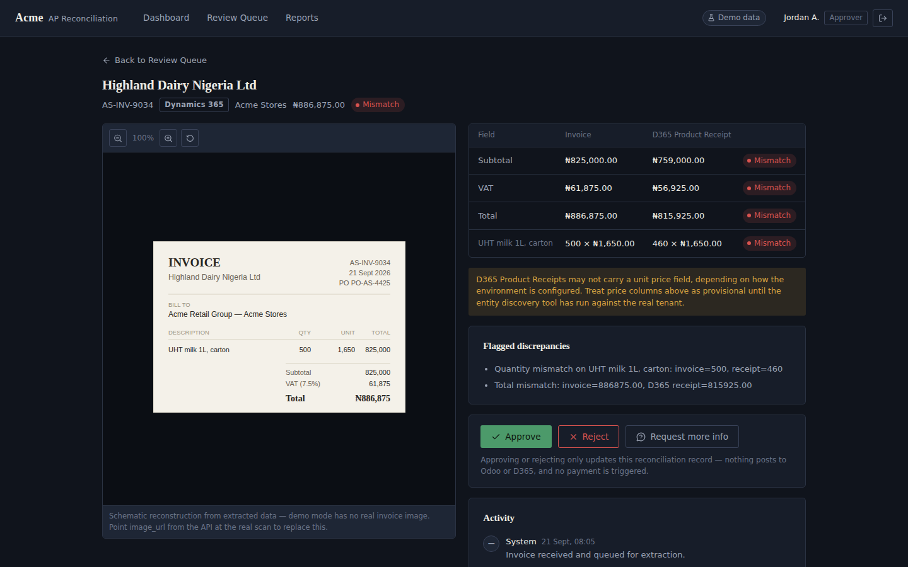
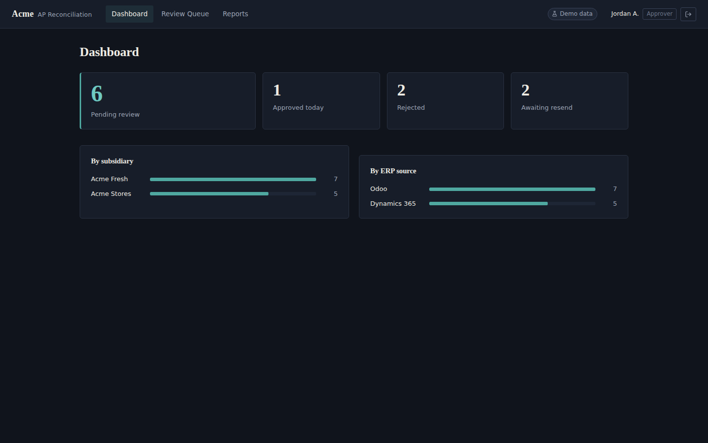
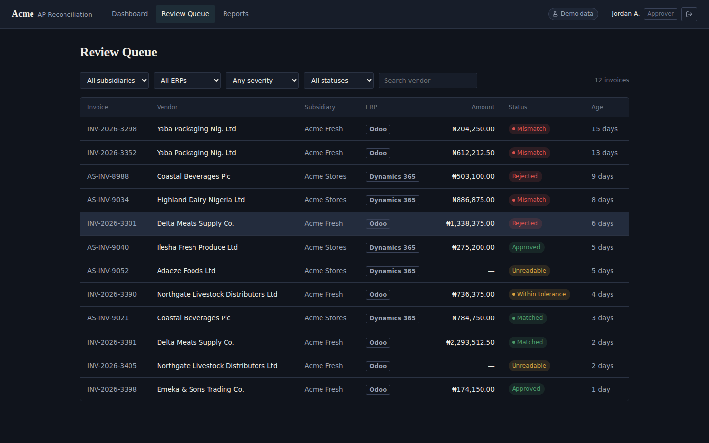
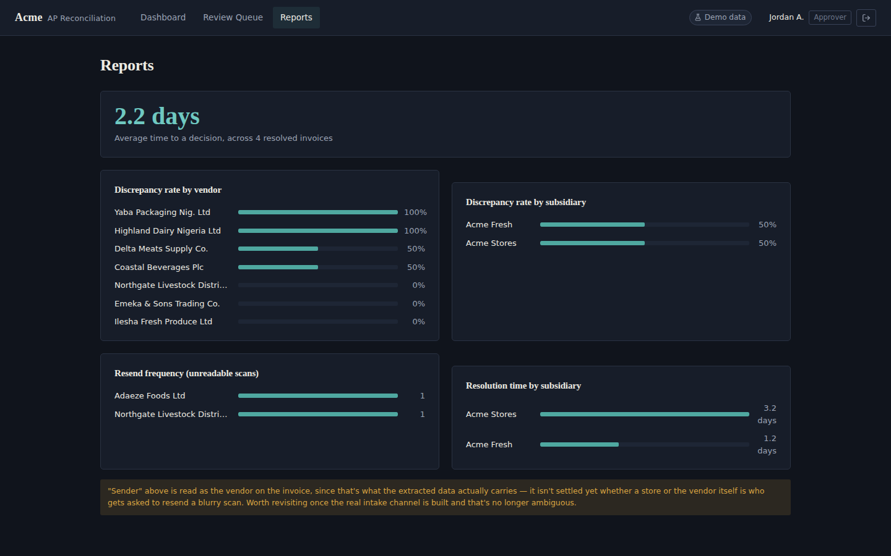

# AP Invoice Reconciliation

Match supplier invoices against purchase orders and goods receipts across **Microsoft Dynamics 365 Finance & Operations** and **Odoo**, with LLM extraction and a human review queue.

Built for finance teams in groups where subsidiaries run different ERPs. Manual invoice processing costs $12.88 to $19.83 per invoice against $2.78 for best-in-class teams ([Parseur, 2026](https://parseur.com/blog/ai-invoice-processing-benchmarks)). The expensive part is the checking; this app automates the comparison and leaves the decision to people.



## How it works

1. **Upload.** Staff submit only a PO number and the invoice file (PDF or photo) through the API.
2. **Find the PO.** The backend looks the PO up in Dynamics 365 and Odoo. Whichever ERP holds it returns the vendor, subsidiary, store and order lines, so nobody types them in.
3. **Extract.** Gemini or Azure OpenAI reads the invoice header and line items. Unreadable scans are marked for a resend instead of guessed.
4. **Match.** Lines are matched by product code, then description. Quantities, prices and totals are compared with a per-vendor tolerance (1% by default), and each field is marked *match*, *within tolerance* or *mismatch*. Results are computed once and stored, so the queue stays fast at 10,000+ invoices a month.
5. **Review.** Reviewers work the queue; approvers approve, reject or ask for more information; every action lands in the invoice's activity trail.

The app never writes to either ERP and never triggers a payment. Approval is a recorded recommendation for the AP process.

## Screens

| Dashboard | Review queue | Reports |
| --- | --- | --- |
|  |  |  |

- **Dashboard:** pending, approved, rejected and awaiting-resend counts, by subsidiary and ERP.
- **Review queue:** filter by subsidiary, ERP, severity, status and vendor (the API also searches by invoice or PO number).
- **Invoice review:** the invoice beside the ERP record, field-level status, flagged discrepancies, actions and activity.
- **Reports:** discrepancy rates, resolution time and resend frequency.
- **Admin:** users and roles, and which ERP each subsidiary routes to.

## Try it

**Frontend only, with demo data (no setup):**

```bash
cd frontend
npm install
npm run dev          # http://localhost:5173
```

**Full stack (API + PostgreSQL in Docker):**

```bash
cd backend
docker compose up -d
docker compose exec backend node scripts/seed.js
docker compose exec backend node scripts/smoke-test.js   # 16 end-to-end checks

cd ../frontend
echo "VITE_API_BASE_URL=http://localhost:3001" > .env
npm install && npm run dev
```

Demo logins (password `demo1234` for all):

| Username | Role | Can do |
| --- | --- | --- |
| `reviewer` | Reviewer | View invoices and comment |
| `approver` | Approver | Reviewer rights, plus approve and reject |
| `vendor_admin` | Vendor & Tolerance Admin | Reviewer rights (tolerance screen not built yet) |
| `auditor` | Auditor | Read-only everywhere, including Admin |
| `admin` | System Admin | Manage users, roles and the subsidiary-to-ERP map |

To connect a real Dynamics 365 environment, Odoo instance or LLM, see [backend/README.md](backend/README.md).

## Stack

| Layer | Tools |
| --- | --- |
| Frontend | React 19, Vite, React Router, plain CSS |
| Backend | Node.js, Express, PostgreSQL (with pg_trgm search), Docker Compose |
| ERP integrations | Dynamics 365 F&O OData via Entra ID (MSAL); Odoo external API over XML-RPC |
| Extraction | Google Gemini or Azure OpenAI, with structured JSON output |
| Security | bcrypt password hashing, expiring sessions, role-based access, rate limiting, Helmet |

## Repository layout

```
backend/     Express API, PostgreSQL migrations, ERP and LLM integrations, seed and smoke test
frontend/    React app; runs on built-in demo data or against the API
  reference-server/   lightweight stand-in API for testing the frontend without Docker
docs/        screenshots
```

## Status

Working: the upload API, PO lookup across both ERPs, extraction, matching, review actions, role-based access, reports and admin. Verified with the backend smoke test and a production build of the frontend.

Not built yet:
- an upload screen in the frontend (uploads go through the API today)
- click-to-verify highlights on the scanned invoice
- the Vendor & Tolerance Manager screen
- a cross-invoice audit trail screen
- automatic resend requests to suppliers
- auto-approval for clean matches
- single sign-on

Dynamics 365 field names differ between customized environments, so run `npm run discover-d365` against a real tenant before going live.

All companies, vendors, people and invoices in this repository are fictional.

---

Built by **Emmanuel Adegbaju**, automation and ERP integration engineer. Want this for your finance team? [Start a project](https://dynamotech.vercel.app/#start-a-project).
